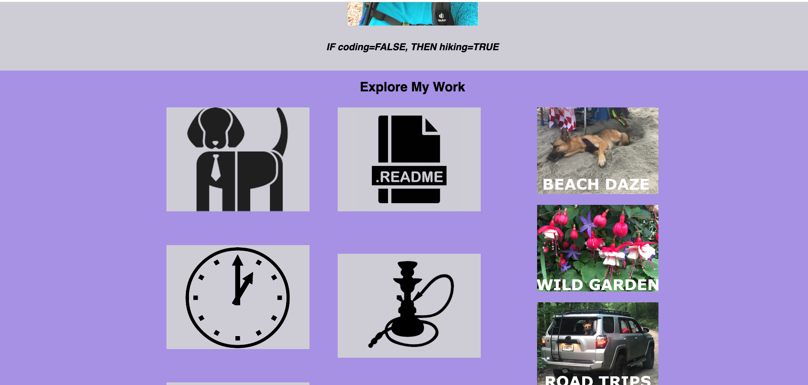
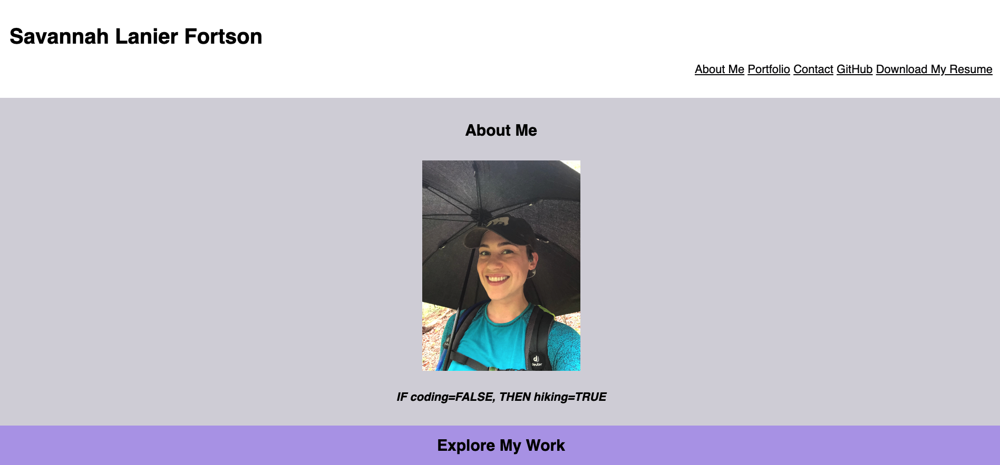

# Portfolio

## Description

The purpose of the project is to create a Portfolio page showcasing my work and experience. The webpage should include About Me, links to previous work, and contact info sections. I will continue to add to this Portfolio as my skills progress, and I have more application links.

https://savannahf.github.io/Portfolio/

Screen Shots can be found below:




## Installation

1. Download or clone repository
2. Open the main page (index.html) on your browser to view webpage
3. Use a text editor to view all coding, Visual Studio Coding is recommended.

_or_

Visit the github-hosted webpage for the user experience!!

## Usage

1. Click on "Download My Resume" to download a PDF of my resume.
2. Updated repo links can be found in the logo thumbnails for "PawMe" (dog logo), "Daily Task Manager" (clock logo), and "JavaScript Quiz" (quiz logo), "README Maker" (README logo), and "The Hookahp - Wilbo Hookahs Store" (hookah logo).

## Credits

This project was created using some of the new skills I have learned about HTML and CSS. Resources include online CSS and HTML guides, as well as lessons in Flexbox and how to structure the images. GIMP used for thumbnail imagery, and all photographs are my own.

## License

MIT License

Copyright (c) [2021] [Savannah L. Fortson]

Permission is hereby granted, free of charge, to any person obtaining a copy
of this software and associated documentation files (the "Software"), to deal
in the Software without restriction, including without limitation the rights
to use, copy, modify, merge, publish, distribute, sublicense, and/or sell
copies of the Software, and to permit persons to whom the Software is
furnished to do so, subject to the following conditions:

The above copyright notice and this permission notice shall be included in all
copies or substantial portions of the Software.

THE SOFTWARE IS PROVIDED "AS IS", WITHOUT WARRANTY OF ANY KIND, EXPRESS OR
IMPLIED, INCLUDING BUT NOT LIMITED TO THE WARRANTIES OF MERCHANTABILITY,
FITNESS FOR A PARTICULAR PURPOSE AND NONINFRINGEMENT. IN NO EVENT SHALL THE
AUTHORS OR COPYRIGHT HOLDERS BE LIABLE FOR ANY CLAIM, DAMAGES OR OTHER
LIABILITY, WHETHER IN AN ACTION OF CONTRACT, TORT OR OTHERWISE, ARISING FROM,
OUT OF OR IN CONNECTION WITH THE SOFTWARE OR THE USE OR OTHER DEALINGS IN THE
SOFTWARE.

```

```
